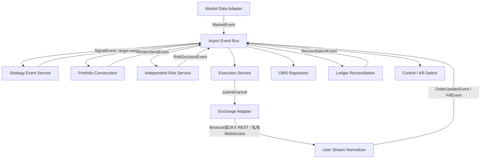
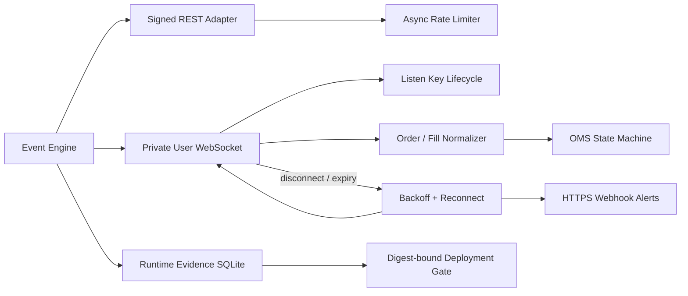
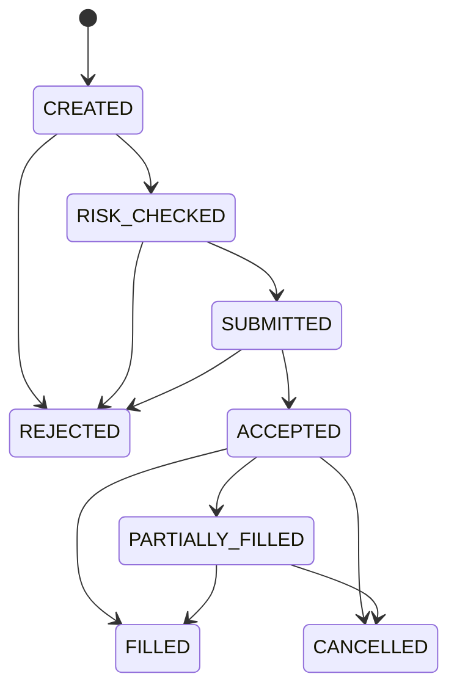
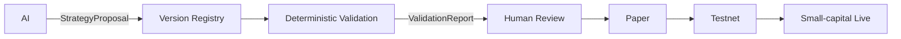

# CryptoLab 事件驱动交易架构

## 架构原则

1. 行情、策略、风控、OMS、执行和账本通过事件通信。
2. 策略只发布目标仓位，不持有API Key，也不能调用Exchange Adapter。
3. 独立风控位于订单意图与执行之间，任何异常均Fail Closed。
4. 交易所余额、持仓和活动订单是账本对账的最终事实。
5. AI只创建候选策略版本和验证报告，无权批准部署或提交订单。
6. 策略版本只能按 `DRAFT → VALIDATED → PAPER → TESTNET → LIVE` 晋级。
7. LIVE使用独立子账户、人工确认和硬资金上限，不能跨阶段上线。

## 主交易链路



### 标准事件

| 事件 | 生产者 | 消费者 | 内容 |
| --- | --- | --- | --- |
| `MarketEvent` | 行情适配器 | 策略、账本 | 标准OHLCV |
| `SignalEvent` | 策略服务 | 组合构建 | 策略版本、目标仓位、理由 |
| `OrderIntentEvent` | 组合构建 | 独立风控 | 方向、数量、参考价 |
| `RiskDecisionEvent` | 独立风控 | 执行服务 | 批准/拒绝及原因 |
| `OrderUpdateEvent` | Exchange Adapter | OMS、账本 | 订单最终或中间状态 |
| `FillEvent` | Exchange Adapter私有用户流 | OMS、账本 | 实时成交ID、数量、价格和手续费 |
| `ReconciliationEvent` | 账本服务 | 控制服务 | 账户快照及差异 |
| `ControlEvent` | 对账/运维 | 风控、Adapter | HALT、Kill Switch |

事件具有唯一`event_id`，并通过`causation_id`追踪因果链。事件总线保留审计日志和Dead Letter。

## 交易所连接与运维服务



- Listen Key在连接时创建，默认每30分钟续期，失效后重新建立用户流；
- OKX不使用Listen Key，而是每次连接执行签名登录并订阅`orders/account`频道；
- `executionReport`实时生成订单更新和成交事件，REST/WebSocket重复消息按订单状态和Fill ID去重；
- REST调用统一执行请求权重、10秒订单数和每日订单数限制；
- 用户流断开、对账差异和运行异常触发分级告警，Webhook只允许HTTPS并进行脱敏、重试和冷却去重；
- 事件引擎同时消费公开行情与私有用户流，任一任务异常都会Fail Closed并留下运行证据。

## 策略与交易解耦

策略的唯一输出是：

```python
Signal(target_weight=0.20, reason="模型或规则说明")
```

策略不能获得以下对象：

- Exchange Adapter
- API Key或Secret
- OMS Repository
- 账户写权限
- 下单、撤单方法

组合构建服务把目标仓位转换为分片订单意图；独立风控批准后，执行服务才创建真实订单。

## 独立风控

`IndependentRiskService`不依赖策略或交易所SDK，输入只有不可变订单意图和账本快照。

检查项：

- 币对白名单
- 行情新鲜度
- 最大单笔名义金额
- 最大持仓比例
- 最低现金储备
- 单日订单数
- 单日亏损熔断
- 最大回撤熔断
- 可卖持仓
- 独立Kill Switch

任何规则失败时`approved_quantity=0`，执行服务不会收到可执行订单。

## OMS状态机



订单使用`client_order_id`保证网络重试幂等。本地订单和成交可通过SQLite恢复。

## 账本与对账

`LedgerReconciliationService`定期从Exchange Adapter重新取得：

- 计价币余额
- 基础币余额
- 可用与冻结余额
- 活动订单
- 持仓

本地活动订单与交易所活动订单不一致时：

```text
Reconciliation discrepancy
  → ControlEvent(HALT)
  → 独立风控Kill Switch
  → Exchange Adapter Kill Switch
  → 禁止后续订单
```

## AI策略治理



AI允许：

- 提出策略名称、参数和理由；
- 生成候选模型或因子组合；
- 触发确定性样本外回测；
- 总结验证报告。

AI禁止：

- 把版本晋级到Paper/Testnet/Live；
- 修改部署证据；
- 开启交易开关；
- 调用Exchange Adapter；
- 绕过独立风控；
- 修改实盘资金上限。

策略版本包含参数指纹、验证报告和不可省略的晋级审计，存储在SQLite。

## 分阶段上线门禁

```text
DRAFT
  ↓ 确定性样本外验证通过
VALIDATED
  ↓ 人工批准
PAPER
  ↓ ≥14天、≥20订单、无对账差异、回撤合格
TESTNET
  ↓ ≥7天、≥10订单、无运行错误、人工风险确认
LIVE
  ↓ 独立子账户、无遗留仓位、资金≤500 USDT
SMALL-CAPITAL LIVE
```

默认门禁可以配置得更严格，但不能跳级。AI角色调用`promote()`会被代码直接拒绝。

LIVE还需要同时满足：

- 策略版本状态为`LIVE`；
- Adapter生产地址与部署声明一致；
- `allow_live=True`；
- `trading_enabled=True`；
- 人工确认短语正确；
- 子账户USDT不超过硬上限；
- 子账户启动时无遗留持仓。

## 推荐运行入口

生产路径不应直接构造策略并调用Adapter，而应使用：

```python
session = GovernedTradingSession(
    governance=registry,
    version_id=approved_version,
    stage=RolloutStage.PAPER,
    adapter=paper_adapter,
    instrument=get_instrument("BTC/USDT"),
)

engine = await session.start()
await engine.run()
```

`GovernedTradingSession`会检查策略版本、运行阶段和Adapter是否严格匹配。

## 模块映射

| 模块 | 文件 |
| --- | --- |
| 事件模型与总线 | `quant_system/events.py` |
| 事件驱动应用引擎 | `quant_system/event_engine.py` |
| 独立风控 | `quant_system/risk_service.py` |
| 账本与对账 | `quant_system/ledger.py` |
| OMS状态机 | `quant_system/oms.py` |
| 策略版本治理 | `quant_system/strategy_governance.py` |
| 上线门禁 | `quant_system/deployment.py` |
| 受治理运行入口 | `quant_system/governed_runtime.py` |
| Exchange Adapter | `quant_system/exchange.py`、`quant_system/adapters/` |
| REST API限流器 | `quant_system/rate_limit.py` |
| 外部告警 | `quant_system/alerts.py` |
| 长时间运行证据 | `quant_system/evidence.py` |

## 当前边界

已完成事件驱动Paper主链路、Binance Testnet与OKX Demo REST Adapter、私有WebSocket用户流、认证生命周期、断线重连、API限流、外部告警、可验证运行证据、策略治理和部署门禁。小资金LIVE只实现安全门禁，不代表已经具备生产上线条件。正式管理真实资金前仍需完成：

- 更低延迟的公开WebSocket逐笔/深度行情（当前策略使用已收盘K线轮询）；
- 独立于应用进程的监控、告警升级与人工值班；
- 数据库高可用与不可变审计存储；
- 灾难恢复演练；
- 实际积累Paper至少14日、Testnet至少7日的长期运行证据；
- 当地法律、税务及交易所合规确认。
